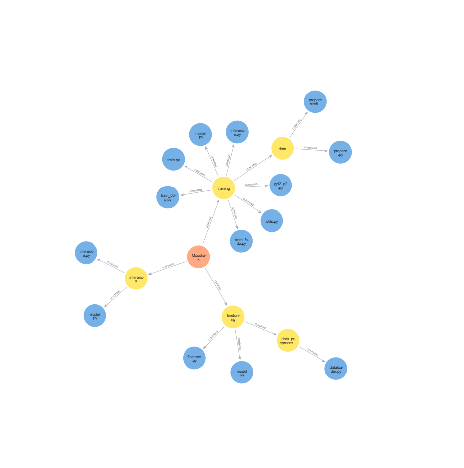

# KGFC

A simple toolkit to allow QA on your codebase

## Installation
1. pip install uv
2. uv venv
3. Activate the environment
    ```
    # Linux 
    .venv/bin/activate

    # Windows
    .venv\Scripts\activate
    ```
4. uv pip install -r requirements.txt
5. create a .env file
    ```
    NEO4J_URI=Neo4j URL | neo4j://localhost
    NEO4J_USER=Your username
    NEO4J_PASSWORD=Your password
    ```
6. Run the Neo4j docker container
    `docker run --name neo4j-container -d -p 7474:7474 -p 7687:7687 -e NEO4J_AUTH=USERNAME/PASSWORD -v /path/to/your/data:/data neo4j`


## How to run
`python -m kgfc.cli --help`


## Running a simple file
python3 -m kgfc.cli --file sample_code/main.py


## Connect to your neo4j 
1. Go to `http://localhost:7474/browser/`
2. Login with your neo4j credentials


### References 
1. https://applyingml.com/resources/search-query-matching/ 
2. [CodeKGC: Code Language Model for Generative Knowledge Graph Construction](https://arxiv.org/abs/2304.09048)
3. https://wala.github.io/graph4code/
4. [Codebase parser](https://github.com/davidfraser/pyan)

### ToDos
- [ ] Debug the issue of docstring
- [ ] Add functionality for vector embedding for code
- [ ] Add method for quering the database
- [ ] Add support for hybrid query search
- [ ] Improvise on the query search